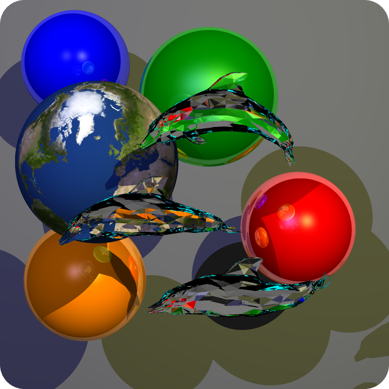
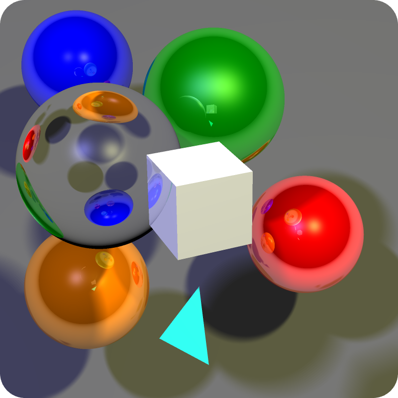
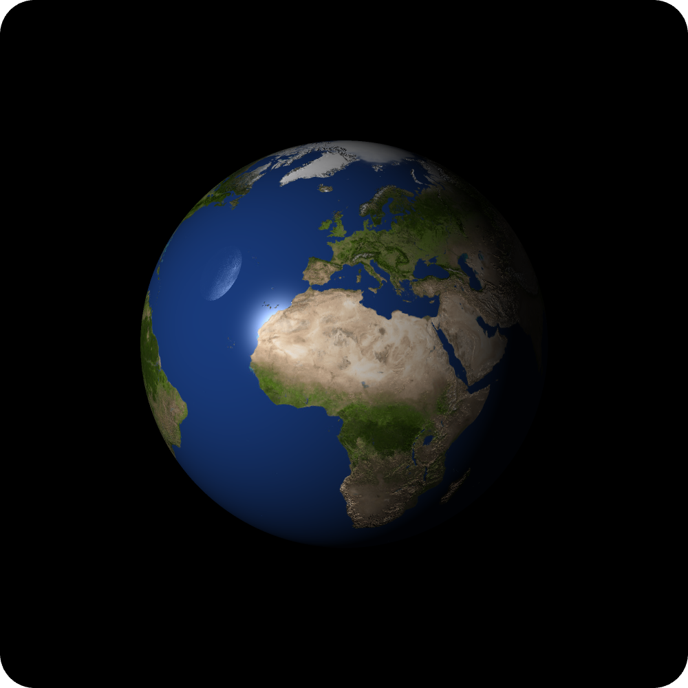

# Ray tracer

 

This project is a ray tracer made in C++ on the CPU that can render complex 3D scenes with custom models and textures, reflexions and refractions, shadows, and more.

 

	

 

# Summary

* **[Summary](#summary)**
* **[Features](#features)**
* **[Install](#install)**
* **[Releases](#releases)**
* **[Tests](#tests)**
* **[Credits](#credits)**

 

# Features

* You can specify the scene you want to render in a YAML file

* You can import 3D models and texture files

* The program implements:
	* Normal and Z-buffer rendering
	* Anti-aliasing
	* Projected and soft shadows
	* Reflections and refractions
	* Gooch shading
	* Normal and specular mapping
	* Textures
	* Basic shapes and custom 3D models

 

# Install

You can run the `buid_vs.bat` file to build the project with **Visual Studio**, or just use the CMake Tools extension on **VS Code**.

 

# Releases

If you just want to test the program without editing the source code, go see the [**Releases**](https://github.com/angeluriot/Ray_tracer/releases).

 

# Tests

	

	

	

 

# Credits

* [**Angel Uriot**](https://github.com/angeluriot): Co-creator of the project.

* [**Arthur Azambe**](https://github.com/arthurazambre): Co-creator of the project.

* [**Guillaume Descomps**](https://github.com/gdescomps): Co-creator of the project.
